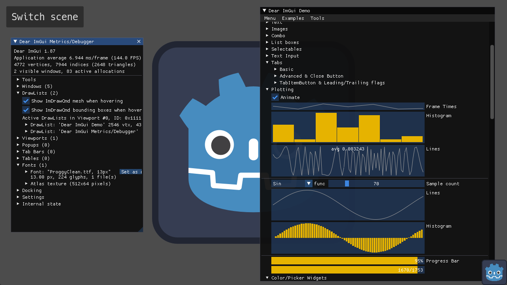

# Dear ImGui plugin for Godot 4




[Dear ImGui](https://github.com/ocornut/imgui) is a popular library for rapidly building tools for debugging and development. This plugin allows you to use ImGui in Godot with C# (with the aid of [ImGui.NET](https://github.com/ImGuiNET/ImGui.NET)), C++, and GDScript.

After installing the plugin, usage is as simple as this:

```csharp
public partial class MyNode : Node
{
    public override void _Process(double delta)
    {
        ImGui.Begin("ImGui on Godot 4");
        ImGui.Text("hello world");
        ImGui.End();
    }
}
```

```gdscript
extends Node

func _process(delta):
    ImGui.Begin("My Window")
    ImGui.Text("hello from GDScript")
    ImGui.End()
```

## Download

If you only need C# support with basic features, you can use the `csharp-only` package. Otherwise,
download the full package which includes GDExtension binaries.

[](https://github.com/pkdawson/imgui-godot/releases/latest)

You can also find Dear ImGui for Godot in the Asset Library.

## Getting Started (C#)

1. Create a project and, if you haven't already added some C# code, use `Project > Tools > C# > Create C# solution`.

2. [Install the plugin](https://docs.godotengine.org/en/stable/tutorials/plugins/editor/installing_plugins.html) by copying over the `addons` folder. Or [use GodotEnv](#package-managers).

3. In Visual Studio or another IDE, open the solution and allow unsafe code, and install `ImGui.NET` with NuGet. Set your target framework to .NET 8 or later. Save and return to Godot.

    (If you prefer to manually edit the .csproj instead, refer to the demo csproj for the necessary modifications.)

> [!IMPORTANT]
> If you are using the GDExtension, you must use a version of ImGui.NET which matches the version that the GDExtension was built with.

4. Back in the Godot editor, click `Build`.

5. Enable the plugin in `Project > Project Settings > Plugins`.

## Getting Started (GDScript)

1. [Install the plugin](https://docs.godotengine.org/en/stable/tutorials/plugins/editor/installing_plugins.html) by copying over the `addons` folder from the full package which includes
the GDExtension.

2. Enable the plugin in `Project > Project Settings > Plugins`.

## Usage

In any Node's `_Process` method, use `ImGuiNET` to create your GUI. Just don't set the `ProcessPriority` in any of your Nodes to either `int.MinValue` or `int.MaxValue`.

### Signals

You can also connect to the `imgui_layout` signal, and use ImGui in the method which handles that signal. This is strongly recommended if you're using process thread groups in Godot 4.1 or later.

```csharp
ImGuiGD.Connect(OnImGuiLayout);
```

### Configuration

If you want to customize fonts or other settings, create an `ImGuiConfig` resource, then go to
`Project > Project Settings > Addons > Imgui` and set the `Config` resource path.

### Widgets

These methods should only be called within `_Process` or an `imgui_layout` callback.

`Image` and `ImageButton` are simple wrappers for your convenience.

`SubViewport` displays an interactive viewport which receives input events. Be sure to change your SubViewport's `Update Mode` to **Always**.

### ImGuiGD

This is the rest of the public API. You typically won't need to call any of these methods directly.

That's about it. Everything else is provided by ImGui itself, via ImGui.NET.

### Export

See the wiki page [Export](https://github.com/pkdawson/imgui-godot/wiki/Export) for details about
exporting without ImGui, such as for release builds or for mobile platforms.

### Examples

There are several [example projects](https://github.com/pkdawson/imgui-godot/tree/master/doc/examples)
showing off different features. [GdsGameProject](https://github.com/pkdawson/imgui-godot/tree/master/doc/examples/GdsGameProject)
and [CSharpGameProject](https://github.com/pkdawson/imgui-godot/tree/master/doc/examples/CSharpGameProject)
try to demonstrate "best practices", particularly for setting up a typical project for export.

## Package managers

If you only need C# support (no GDExtension), you can use [GodotEnv](https://github.com/chickensoft-games/GodotEnv/)
to install and update imgui-godot. The configuration should be something like:

```json
{
  "addons": {
    "imgui-godot": {
      "url": "https://github.com/pkdawson/imgui-godot",
      "checkout": "6.x",
      "subfolder": "addons/imgui-godot"
    }
  }
}
```

## [Tool] use (ImGui in the Godot Editor)

Lets start with a simple example:

```csharp
[Tool]
public partial class Hello : Node3D
{
	public override void _Process(double delta)
	{
		ImGui.Begin("ImGui on Godot 4");
		ImGui.Text("hello world Test");
		ImGui.End();
	}
}
```

To use ImGui from within the Godot Editor, you must do the following:

1. Install the full GDExtension version of ImGui-Godot
2. call ImGuiGD.ToolInit() first.

Failure to do these will cause the godot editor to hard crash when running the above example.  Comment out the `ImGui.` lines and rebuild to prevent future crashes.

An easy way to ensure `ImGuiGD.ToolInit()` is always called is to use a `[ModuleInitializer]`, as shown:

```csharp
internal static class ImGuiInit
{
	[ModuleInitializer]
	public static void DoInit()
	{
		ImGuiGD.ToolInit();
	}
}
```

If you do this and still don't see the "hello world Test" text, keep in mind that ImGui will be rendered somewhere in the Godot Editor window, not constrained to the Camera viewport.  It might be hiding in plain sight, like this image shows:  


## Credits

Code written by Patrick Dawson and contributors, released under the MIT license

Godot Logo (C) Andrea Calabró, distributed under the terms of the Creative Commons Attribution 4.0 International License (CC-BY-4.0 International) <https://creativecommons.org/licenses/by/4.0/>

Hack font distributed under the [MIT license](https://github.com/source-foundry/Hack/blob/master/LICENSE.md)

M PLUS 2 font licensed under the SIL Open Font License, Version 1.1.

3D scene demo borrowed from [godot-demo-projects](https://github.com/godotengine/godot-demo-projects/tree/master/viewport/gui_in_3d)

This plugin's functionality relies heavily on [ImGui.NET](https://github.com/ImGuiNET/ImGui.NET) by Eric Mellino
